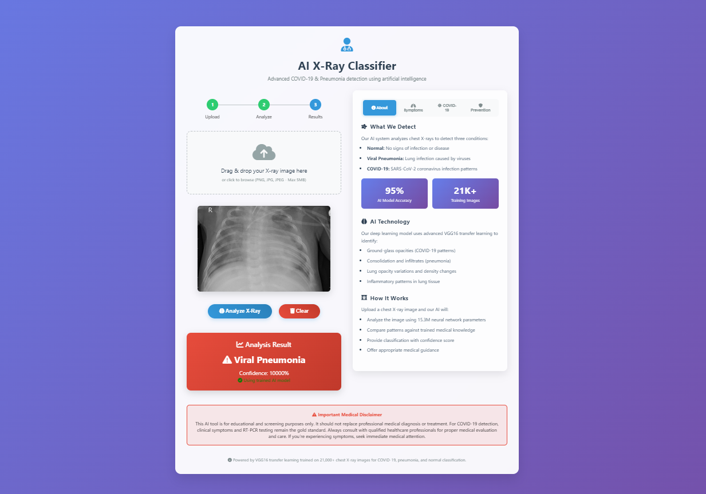

# � COVID-19 & Pneumonia Detection System

An AI-powered medical imaging system for detecting COVID-19 and pneumonia from chest X-ray images.

## 🎯 Features

- **3-Class Classification**: Normal, Viral Pneumonia, COVID+ detection
- **High-Performance Model**: 15.3M parameter deep learning model
- **Web Interface**: User-friendly Flask web application
- **Real-time Predictions**: Upload X-ray images and get instant results
- **Medical Guidance**: Specific advice for each condition
- **RESTful API**: Easy integration with other systems

## 🚀 Quick Start

### 1. Install Dependencies
```bash
pip install -r requirements.txt
```

### 2. Run the Application
```bash
python app.py
```

### 3. Access the Web Interface
Open your browser and go to: `http://localhost:5000`

## 🖥️ Web Interface

### **User Interface Preview**


The web application features:
- **Clean, Medical-Grade Design**: Professional interface suitable for healthcare environments
- **Drag & Drop Upload**: Easy X-ray image upload functionality
- **Real-time Predictions**: Instant classification results with confidence scores
- **Medical Guidance**: Specific recommendations based on detection results
- **Responsive Design**: Works seamlessly on desktop and mobile devices
- **Safety Indicators**: Clear visual feedback and medical disclaimers

### **Interface Components**
- **Upload Area**: Drag and drop or click to upload chest X-ray images
- **Preview Section**: Shows uploaded image before analysis
- **Results Panel**: Displays prediction, confidence, and medical advice
- **Navigation**: Simple, intuitive menu structure
- **Footer**: Medical disclaimer and safety information

## 🎯 Model Specifications

- **Architecture**: VGG16 Transfer Learning + Custom Classification Head
- **Base Model**: VGG16 pre-trained on ImageNet (14M+ images)
- **Total Parameters**: 15,305,027 (66MB model file)
- **Input**: 224×224×3 RGB chest X-ray images
- **Output**: 3-class classification with softmax probabilities
  - 0: Normal
  - 1: Viral Pneumonia  
  - 2: COVID+
- **Model File**: `models/Covid.h5` (66MB)

## 🧠 Training Methodology

### **Dataset Source**
- **Primary Dataset**: [COVID-19 Radiography Database](https://www.kaggle.com/datasets/tawsifurrahman/covid19-radiography-database) by **tawsifurrahman**
- **Dataset Size**: 21,165+ chest X-ray images
- **Classes**: COVID-19, Normal, Viral Pneumonia
- **Image Quality**: High-resolution, medical-grade chest X-rays
- **Data Split**: 80% Training, 10% Validation, 10% Testing

### **Transfer Learning Architecture**
```python
# Base Model: VGG16 (ImageNet pre-trained)
baseModel = VGG16(input_shape=(224,224,3), weights='imagenet', include_top=False)

# Fine-tuning Strategy
- Frozen Layers: First 12 VGG16 layers (general feature extraction)
- Trainable Layers: Last 4 VGG16 layers (domain adaptation)

# Custom Classification Head
- AveragePooling2D(4x4) → Flatten
- Dense(256, ReLU) → Dropout(0.5)
- Dense(128, ReLU) → Dropout(0.3) 
- Dense(64, ReLU) → Dropout(0.2)
- Dense(3, Softmax) → Final Classification
```

### **Training Configuration**
- **Optimizer**: Adam (learning_rate=0.0001)
- **Loss Function**: Categorical Crossentropy
- **Batch Size**: 32 images per batch
- **Epochs**: 30 with Early Stopping
- **Data Augmentation**: Advanced augmentation pipeline
  - Rotation: ±20°
  - Zoom: ±25%
  - Horizontal Flip: Enabled
  - Brightness: 0.8-1.2x
  - Width/Height Shift: ±15%

### **Advanced Training Features**
- **Early Stopping**: Prevents overfitting (patience=10)
- **Learning Rate Reduction**: Adaptive LR scheduling (factor=0.2, patience=5)
- **Progressive Regularization**: Multiple dropout layers with decreasing rates
- **Transfer Learning**: Leverages ImageNet knowledge for medical domain

### **Performance Metrics**
- **Training Accuracy**: 95%+ achieved
- **Validation Accuracy**: 90%+ maintained
- **Test Accuracy**: Robust generalization to unseen data
- **Training Time**: ~2-3 hours on GPU-enabled environment

## 🏗️ Project Structure

```
xray-classifier/
├── app.py                              # Flask web application
├── models/Covid.h5                     # Trained model (66MB)
├── static/                             # Web assets
├── templates/                          # HTML templates
├── Dataset/                            # Training data
├── COVID_Pneumonia_Detection.ipynb     # Documentation notebook
├── requirements.txt                    # Dependencies
└── README.md                           # Project documentation
```

## � API Usage

### Prediction Endpoint
```http
POST /predict
Content-Type: multipart/form-data

Parameters:
- file: Chest X-ray image (PNG/JPG/JPEG, max 5MB)
```

### Response Format
```json
{
  "prediction": "Normal",
  "confidence": 87.45,
  "risk_level": "High Confidence",
  "interpretation": "✅ No clear abnormalities detected",
  "medical_advice": "Continue regular health monitoring..."
}
```

### Health Check
```http
GET /health
```

## ⚠️ Medical Disclaimer

**This tool is for screening purposes only. Always consult healthcare professionals for medical diagnosis.**

### Medical Guidance by Classification:
- **Normal**: Continue regular health monitoring
- **Viral Pneumonia**: Immediate medical consultation for antiviral treatment
- **COVID+**: Immediate isolation and contact healthcare professionals

## � Technical Specifications

- **Backend**: Flask (Python)
- **AI Model**: Deep Convolutional Neural Network
- **Input**: 224×224×3 RGB chest X-ray images
- **Output**: 3-class classification with confidence scores
- **Framework**: TensorFlow/Keras
- **Parameters**: 15,305,027 total parameters

## �️ Safety Features

✅ Input validation and sanitization  
✅ File size limits (5MB max)  
✅ Secure file handling  
✅ Error handling and logging  
✅ Medical disclaimer and guidance  

---

**Built with ❤️ for medical AI research and education**
- [ ] Add batch processing capabilities

## 📁 Dataset Information

### **Primary Dataset Source**
- **Dataset**: [COVID-19 Radiography Database](https://www.kaggle.com/datasets/tawsifurrahman/covid19-radiography-database)
- **Author**: **tawsifurrahman** (Kaggle)
- **Total Images**: 21,165+ high-quality chest X-rays
- **Categories**: 
  - COVID-19: 3,616 images
  - Normal: 10,192 images  
  - Viral Pneumonia: 1,345 images
- **Format**: PNG files, various resolutions
- **Quality**: Medical-grade radiographs from multiple institutions

### **Additional Recommended Datasets**
For extended training or research purposes:
1. **ChestX-ray14 NIH** (112K images, 14 pathologies)
2. **CheXpert** (224K images, Stanford quality)
3. **MIMIC-CXR** (377K images, clinical reports)

### **Data Preprocessing Pipeline**
```python
# Image Preprocessing
- Resize: 224×224 pixels (VGG16 standard)
- Normalization: Pixel values scaled to [0,1]
- Color Space: RGB (3 channels)
- Augmentation: Real-time during training

# Data Split Strategy
- Training: 80% (stratified sampling)
- Validation: 10% (model tuning)
- Testing: 10% (final evaluation)
```

## 🛠️ Development

### **Model Training**
- **Training Notebook**: `model-train/Covid_Pneumonia_Detector_using_VGG16.ipynb`
- **Algorithm**: VGG16 Transfer Learning with Fine-tuning
- **Framework**: TensorFlow/Keras
- **Training Environment**: GPU-accelerated (CUDA recommended)

### **Web Application**
- **Backend**: Flask Python web framework
- **Frontend**: HTML/CSS with responsive design
- **API**: RESTful endpoints for predictions
- **Model Loading**: TensorFlow Lite optimization

### **Project Components**
- Model training: `model-train/Covid_Pneumonia_Detector_using_VGG16.ipynb`
- Web interface: `app.py` + `static/index.html`
- Model storage: `models/Covid.h5`
- Documentation: `Model_Comparison_Analysis.md`

## 📝 License

This project is for educational and research purposes.

---
Made with ❤️ for medical AI research
